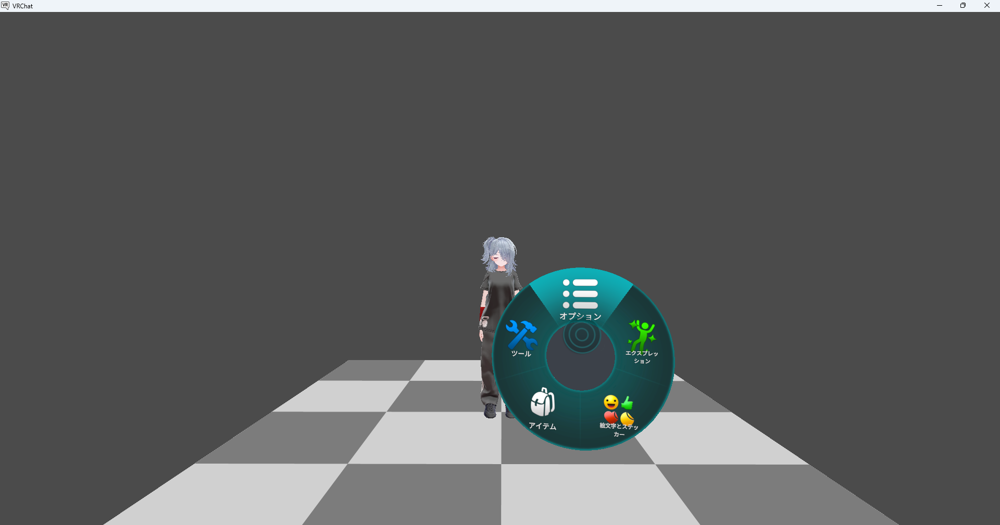
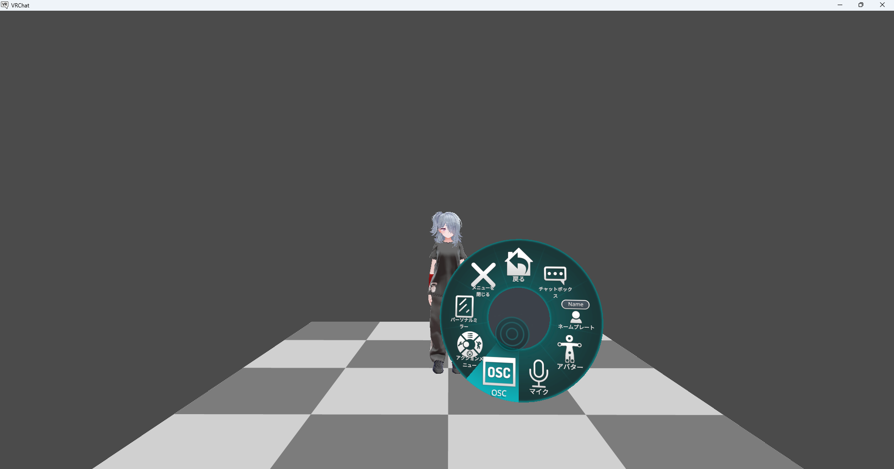
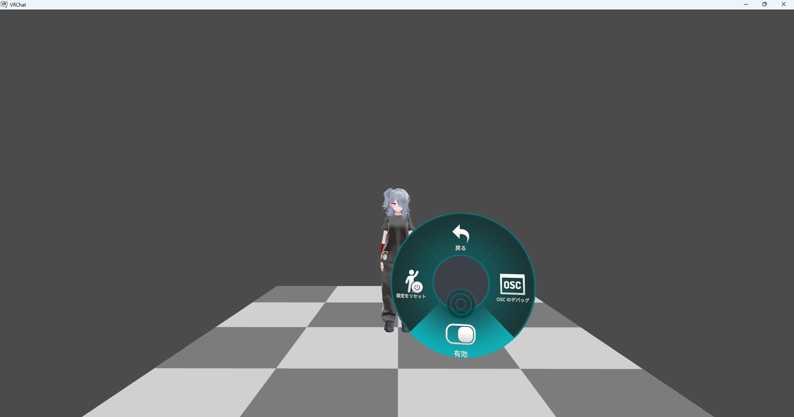
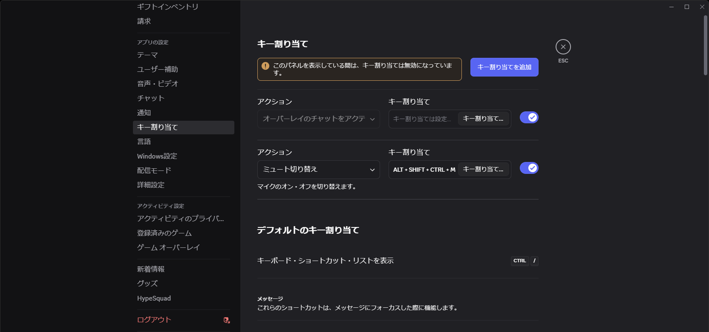
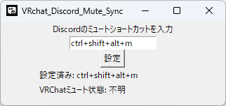
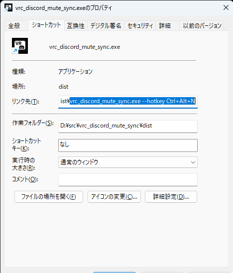

# 簡単な説明
VRChatのマイクミュートと，Discordのマイクミュートを連携させるソフトウェアです。

# クイックスタートガイド
1. VRChatでOSCを有効にする。
2. Discordにミュート切り替えのキー割り当て(Ctrl+Shift+Alt+M)を設定する。
3. このソフトウェア起動する。(ダウンロード先-> [こちら][releaseURL])

これで動作します。  
VRchatのミュートを切り替えるたびに，Discordのミュートも切り替えるので，最初にMute状態を調整する必要があります。

各ステップの詳細と，設定のカスタム方法は以降で説明します。  
ここまでの説明でうまく動作しなかったら以降を読んでください。

> [!NOTE]
>releaseしている実行ファイルは，pyinstallerで作成しています。  
>そのためアンチウイルスソフトに検知されることがあります。  
>ソースコードも公開しているので，心配な方は自分でBuildしてください。  
>build.txtにexe化時のオプションが記載されています。

# 1.VRChatでOSCを有効にする
1. アクションメニューを開く。
2. オプションを選択。
3. OSCを選択。
4. 有効にする。

# 2.Discordにミュート切り替えのキー割り当てを設定する
1. 歯車マークを押下して，ユーザー設定を開く。
2. アプリの設定内のキー割り当てを選択する。
3. キー割り当てを追加をクリックする。
4. アクションでミュート切り替えを選択する。
5. すぐ右の キー割り当て... をクリックする。
6. キーボードのCtrl+Shift+Alt+Mを押下する。

「デフォルトのキー割り当て」に既にミュート切り替えがCtrl+Shift+Mで設定されていますが，これはDiscordのWindowがアクティブの時しか効かないようなので，この設定を追加しています。  
別のショートカットを設定したい場合は後述の説明を読んでください。

# 3.このソフトウェアを起動する
1. 実行ファイル(vrc_discord_mute_sync_XX.exe)を[ダウンロード][releaseURL]する。
2. 実行する。 (インストール不要です！)

# 別のショートカットを設定したい
Ctrl+Shift+Alt+M を使うことを推奨しますが，何らかの事情により別のショートカットを設定したい場合はこのソフトウェアの設定を変更してください。  

Window内の入力欄に設定したいショートカットを入力して，設定ボタンを押下するとショートカットを変更できます。

また，毎回設定を変更するのが面倒で起動時からショートカットを変更しておきたい場合は，このソフトウェアに対するショートカットを作成して，引数に
> --hotkey "設定したいショートカット"

と設定してください。

Ctrl+Alt+Nを設定したいときの例

> vrc_discord_mute_sync.exe --hotkey Ctrl+Alt+N

[releaseURL]: <https://github.com/0E7E/vrc_discord_mute_sync/releases>